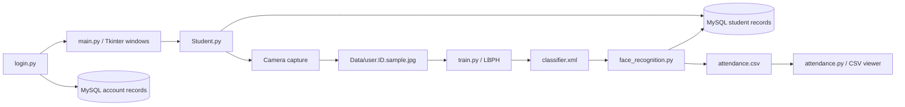

# vision-attend

**Browser and desktop attendance prototypes with OpenCV face recognition and human-reviewed attendance.**

vision-attend uses Tkinter for its interface, MySQL for student and account records, and OpenCV for face detection and LBPH recognition. Its main workflow captures face samples, trains a local classifier, looks up recognized student IDs, and writes attendance rows to a CSV file.

**Desktop edition status:** the repository contains the application code, a Haar face detector, and a saved LBPH classifier. Most decorative UI images, the training-image directory, and database schema/data are missing. The desktop edition needs those resources. The browser edition below is independently runnable without them.

## Browser edition — free deployment

**Live application:** [Open Vision Attend](https://vision-attend-a43s.onrender.com/) — no login required.

The new browser edition is a self-contained FastAPI application under `web/`. It provides camera capture or JPEG/PNG upload, enrollment of up to ten students with three photos each, session-specific LBPH training, recognition suggestions, explicit human confirmation, per-student daily attendance deduplication (UTC), and CSV export.

It does not use the desktop MySQL database or the bundled classifier, whose identity mapping is unknown. Each visitor receives an isolated random session cookie. Photos are processed on the hosting server; normalized face samples, learned descriptors, student details, and attendance are held only in process memory. They expire within 31 minutes of inactivity, can be cleared by the user, and disappear on server restart. Export attendance before leaving. No cross-device synchronization or durable storage is provided.

Recognition uses Haar face detection and LBPH distance with a conservative heuristic threshold of 65; this is not a calibrated confidence probability. The prototype has no liveness detection or measured accuracy and must not be used for official attendance decisions. Users must have permission from the photographed person. Recognition never writes attendance without a separate confirmation.

### Run the web app

```bash
python3.11 -m venv .venv-web
source .venv-web/bin/activate
pip install -r requirements-web.txt
COOKIE_SECURE=false uvicorn web.app:app --host 127.0.0.1 --port 8000
```

Open `http://localhost:8000`. Camera access requires localhost or HTTPS. The camera is optional; photo upload works as an alternative. For hosted deployment retain `COOKIE_SECURE=true` and use one worker because session state lives in memory.

### Deploy on Render

Create a Blueprint from this repository. `render.yaml` defines a free Python web service; no database, password, API key, or paid service is needed. The health endpoint is `/health`. The free service may sleep during inactivity. At most 16 active sessions are retained to bound memory usage; additional visitors receive a capacity message until sessions expire.

### Browser-edition checks

```bash
pip install pytest httpx
python -m pytest tests -q
```

Tests cover actual LBPH training/prediction with synthetic arrays, explicit confirmation, deduplication, session isolation and expiry, consent, request size limits, invalid images, and CSV formula escaping. Synthetic tests do not establish real-world face-recognition accuracy. Desktop setup and its pre-existing limitations are documented below.

## Contents

- [Capabilities](#capabilities)
- [Architecture](#architecture)
- [Installation](#installation)
- [Database configuration](#database-configuration)
- [Required files](#required-files)
- [Attendance workflow](#attendance-workflow)
- [Repository map](#repository-map)
- [Verification](#verification)
- [Known limitations](#known-limitations)
- [Development priorities](#development-priorities)

## Capabilities

| Area | Included behavior |
| --- | --- |
| Student records | Forms and MySQL queries for adding, viewing, updating, and deleting student details. |
| Face capture | Reads camera index `0`, detects a face, converts a crop to grayscale, and saves up to 100 images per capture run. |
| Training | Reads labeled images from `Data/`, trains OpenCV's LBPH recognizer, and overwrites `classifier.xml`. |
| Recognition | Detects faces with a Haar cascade, predicts a numeric label, and queries student details for that label. |
| Attendance recording | Appends recognized student details, time, date, and `Present` to `attendance.csv`. |
| Attendance viewer | Imports and exports CSV files, displays rows, and edits the displayed selection. Export synchronization has a known defect. |
| Accounts | Registration, database-backed login, and security-question password reset screens. |
| Supporting windows | Help and project information windows. |

The table above describes the original desktop workflows. The browser edition is separate; neither edition has measured recognition accuracy or cloud synchronization.

## Architecture



Tkinter runs the application event loop. OpenCV owns separate image/camera windows during capture, training, and recognition. Pillow loads interface images, NumPy supplies training arrays, and MySQL Connector/Python executes database queries.

The project uses `cv2.face.LBPHFaceRecognizer_create()`. Install **`opencv-contrib-python`**, which includes this module, rather than the base-only or headless OpenCV package. The local file `face_recognition.py` is part of this project; it does not require the unrelated third-party package with that name.

## Installation

### Prerequisites

- Python 3.11 is a suggested starting point.
- A Python installation with Tk support and an available graphical desktop.
- MySQL with databases and tables matching the code's expectations.
- A camera for capture and recognition, plus operating-system camera permission.
- The missing images listed under [Required files](#required-files).

### Install dependencies

```bash
git clone https://github.com/quixoticalcoder/vision-attend.git
cd vision-attend
python3 -m venv .venv
source .venv/bin/activate
pip install -r requirements.txt
```

On Windows, use `.venv\Scripts\activate`. Tkinter is supplied by your Python/OS installation, not by a pip dependency in this repository. Verify it separately with `python -m tkinter`.

The dependency file has broad compatibility bounds rather than a reproducible lockfile. Avoid installing multiple OpenCV distributions into the same environment.

### Start the application

After supplying images and configuring MySQL:

```bash
python login.py
```

For development, the workspace also has a direct entry point:

```bash
python main.py
```

That direct entry point bypasses the login screen. Login therefore does not form a security boundary around the desktop application.

## Database configuration

[`config.py`](config.py) centralizes database options and resolves project files relative to the repository directory. It replaces machine-specific home-directory paths and embedded database credentials.

Set environment variables in the terminal that launches Python:

```bash
export VISION_ATTEND_DB_HOST=localhost
export VISION_ATTEND_DB_PORT=3306
export VISION_ATTEND_DB_USER=vision_attend
export VISION_ATTEND_DB_PASSWORD='your-local-database-password'
export VISION_ATTEND_DB=vision_attend
export VISION_ATTEND_AUTH_DB=vision_attend_auth
```

| Variable | Default | Purpose |
| --- | --- | --- |
| `VISION_ATTEND_DB_HOST` | `localhost` | MySQL host |
| `VISION_ATTEND_DB_PORT` | `3306` | MySQL port |
| `VISION_ATTEND_DB_USER` | `vision_attend` | Connection user |
| `VISION_ATTEND_DB_PASSWORD` | Empty string | Connection password |
| `VISION_ATTEND_DB` | `vision_attend` | Student-record database |
| `VISION_ATTEND_AUTH_DB` | `vision_attend_auth` | Account database |

PowerShell uses `$env:VARIABLE="value"` instead of `export`. The application does not load a `.env` file automatically. Existing installations can point these variables to their existing databases without renaming them.

### Schema expectations

No SQL dump, migration, or initialization command is included. Database creation must be completed separately. The following is a map of the current queries, not a verified schema migration:

| Table | Required column order for positional inserts |
| --- | --- |
| Student database: `student` | `Dep`, `Course`, `Year`, `Semester`, `StudentID`, `Name`, `Division`, `RollNo`, `Gender`, `DOB`, `Email`, `PhoneNo`, `Address`, `Teacher`, `Photo Sample` |
| Account database: `register` | First name, last name, contact, `email`, `securityQ`, `securityA`, `password` |

The account insert does not name its columns, so the first three column names are not established by that query, but their order matters. The student table has a literal space in `Photo Sample`. Recognition expects numeric model labels to map to `StudentID`. Choose compatible field types and constraints deliberately, then verify every CRUD operation against a disposable database before using existing records.

## Required files

The source includes these image assets:

- `360_F_629815969_fP8umPrlXV8MhFYPU54YEhcGo0TgMSIk.jpg`
- `traindata.png`

The remaining image references need matching local files:

```text
Stanford.jpeg
face.jpeg
college.webp
bg.webp
student.jpeg
attendance.jpeg
customercare.png
photo.png
developer.png
exit.png
Photo/
├── s1.jpeg
├── s2.jpeg
├── s3.jpeg
├── s4.jpeg
├── s5.jpeg
├── face2.png
├── beach.jpeg
├── lock.login.png
├── Register.jpeg
├── Register1.png
└── login1.jpeg
```

These are expected filenames, not supplied downloads. Missing assets cause Pillow/Tkinter errors when their window is constructed. Use media you have permission to use.

### Face-model resources

| Resource | Status / role |
| --- | --- |
| `haarcascade_frontalface_default.xml` | Included frontal-face detector with its original third-party license notice. |
| `classifier.xml` | Included saved LBPH model. Its original training data and student mapping are not supplied. |
| `Data/` | Not included. Create this directory before capturing or supplying samples. |
| `attendance.csv` | Created on first attendance write and ignored by Git. Personal sample attendance rows are not distributed. |

The expected training filename is `user.<numeric-student-id>.<sample-number>.jpg`. Training takes the second dot-separated component as the label. The existing capture routine has an ID-assignment defect, so inspect filenames and their correspondence to database IDs before training. Back up `classifier.xml` before running training, because training overwrites it.

## Attendance workflow

1. Configure the student and account databases, provide missing interface images, and create `Data/`.
2. Launch `login.py`, register a local account, and sign in. Alternatively, use `main.py` for direct development access.
3. Open **Student Details** and create a student record.
4. Capture samples only after checking the current ID-assignment behavior. The capture loop saves grayscale 450×450 crops and stops at 100 samples or Enter.
5. Verify every sample label against `StudentID`, then open **Train Data**.
6. Open **Face Detector**. The recognizer reads `classifier.xml` and camera index `0`.
7. For predictions above the hardcoded score threshold, the app displays the student fields and attempts an attendance write. Press Enter to end recognition.
8. Open **Attendance**, import the CSV, and review its rows.

Recognition converts LBPH distance using `int(100 * (1 - distance / 300))` and accepts scores above `77`. This is a heuristic score, not a calibrated probability or verified accuracy percentage.

Attendance rows contain seven fields in this order:

```text
student_id,roll_number,name,department,time,date,status
```

The writer uses `HH:MM:SS`, `DD/MM/YYYY`, and the status `Present`. It does not write a header. The current duplicate check is not a reliable per-student, per-day attendance policy.

## Repository map

| File | Responsibility |
| --- | --- |
| `main.py` | Main navigation and child-window launchers |
| `Student.py` | Student forms, MySQL CRUD, and camera sample capture |
| `train.py` | Image loading and LBPH training |
| `face_recognition.py` | Camera recognition, student lookup, and CSV writes |
| `attendance.py` | CSV import/export and attendance table |
| `login.py` | Login, password reset, and an embedded registration class |
| `register.py` | Separate registration implementation |
| `developer.py` | Neutral project-information window |
| `helps.py` | Help screen and repository issue location |
| `config.py` | Portable paths and environment-based MySQL options |
| `requirements.txt` | Python runtime dependencies |

## Verification

Basic checks after installation:

```bash
python -m compileall -q .
python -m pip check
python -c "import cv2; print(cv2.__version__); print(hasattr(cv2, 'face'))"
```

No automated test suite is included. Syntax and model-loading checks do not establish that the GUI, camera, database, or identity mapping works end to end. Test those interactions on a graphical machine with disposable records and correctly labeled samples. Do not infer model quality from the presence of `classifier.xml`.

## Known limitations

- **Incomplete checkout resources:** most UI images, training samples, and database definitions are absent.
- **Capture labels:** sample capture derives a label from the count of student records instead of reliably using the selected ID. Its update condition also passes a Boolean comparison as the student identifier.
- **Attendance deduplication:** the writer collects the first CSV field and compares several differently typed values against it. It neither consistently normalizes IDs nor checks the date, leading to duplicate or suppressed rows.
- **CSV updates:** the Update action changes the Treeview row, but export reads the separate `mydata` list. Displayed edits may therefore be lost in exported files. Cancelled imports and blank rows also need handling.
- **Account security:** passwords and security answers are stored and compared directly. There is no password hashing, role enforcement, rate limiting, or secure reset-token flow. Direct workspace launch bypasses login.
- **Reset and error handling:** some reset branches reference the wrong widget/value or an undefined message object. Some database cleanup paths assume a connection was successfully created.
- **Recognition performance:** database connections and multiple queries occur inside the per-face recognition loop. The application lacks connection reuse, liveness detection, and evaluation of its threshold.
- **UI portability:** large fixed window dimensions and absolute widget coordinates may be clipped on smaller displays. Long-running operations share the desktop event flow.
- **Data lifecycle:** student records, face samples, learned face descriptors, and attendance logs need deliberate access and retention controls. The repository does not implement those policies.

## Development priorities

Start by supplying a tested schema and the missing assets. Then correct sample-to-student mapping, implement a date-aware attendance policy, and make CSV updates persist. Add password hashing and explicit access checks before treating login as authentication. Finally, evaluate recognition with labeled data and add tests for record updates, camera failures, empty training folders, and CSV round trips.

## License and attribution

No project-wide license file is included. The Haar cascade contains its own third-party license and attribution, which remain intact. Review the rights for the application, pretrained classifier, and images before redistribution. Use `vision-attend` consistently in project-facing text and documentation.
